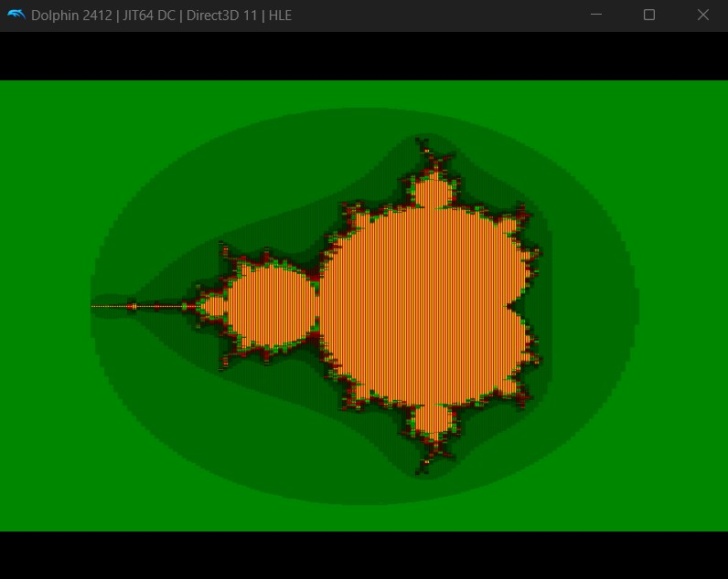

# Mandelbrot Set grapher for Wii

This repository contains a Wii homebrew application that renders the Mandelbrot set with interactive controls using the Wii Remote. The application is written in C using libogc and is designed to be compiled with Programmer's Notepad.

## How it looks (on Dolphin Emulator)


## Features

- **Real-time Mandelbrot Rendering:** Generates the Mandelbrot set on the Wii.
- **Interactive Controls:**  
  - **A Button:** Increase the maximum iterations (improves detail).  
  - **B Button:** Decrease the maximum iterations.  
  - **Directional Pad:** Move the center of the fractal.  
  - **PLUS / MINUS:** Zoom in and out.  
  - **HOME Button:** Return to the Homebrew Channel.
  
## Requirements

- [devkitPro](https://devkitpro.org) (with the Wii toolchain installed)
- libogc and its dependencies
- A development environment capable of running Makefiles (e.g., MSYS2 on Windows, Linux, etc.)
- Programmer's Notepad. Please see this tutorial on YouTube: [](https://www.youtube.com/watch?v=noxGGdxHbDY)


## Files Included

- **Makefile**  
  Build script configured for Wii development using `wii_rules` from devkitPro.

- **source/main.c**  
  The main source code for the Wii Mandelbrot application.

- **(Optional) meta.xml**  
  Metadata for the application (if you wish to add it for Homebrew Channel display).

## Building the Application

1. **Set Up Your Environment:**  
   Ensure that the `DEVKITPPC` environment variable is set and points to your devkitPPC installation. For example:
   ```bash
   export DEVKITPPC=/path/to/devkitPro/devkitPPC
